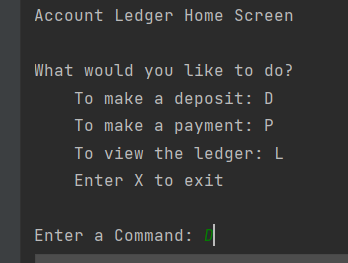
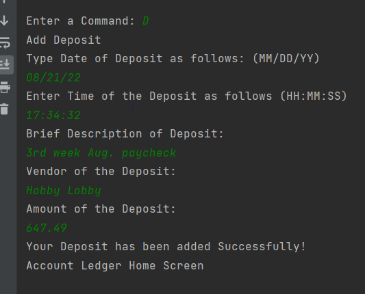
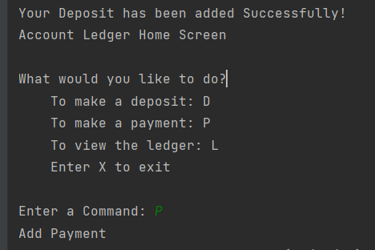
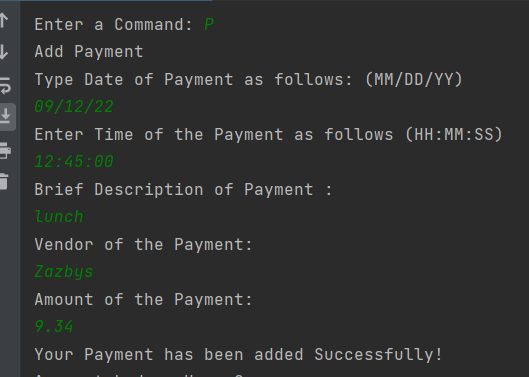
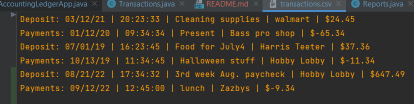
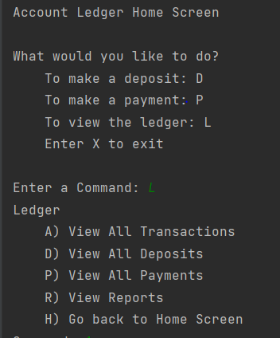
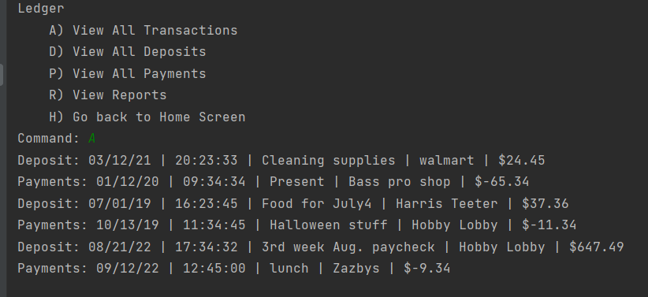
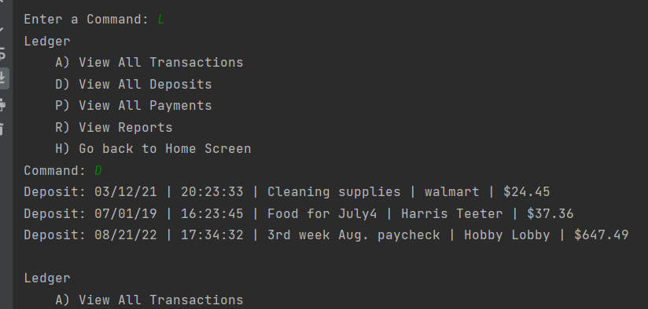
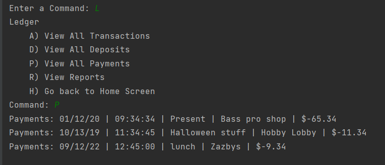
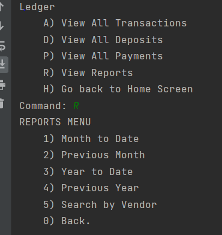

# Capstone1_AccountingLedger
This application allows you to track financial transactions for personal or business use.

Transactions are saved in the form of a deposit or payment in to a transactions.csv file.

The user will be prompted for the following info. (date, time, description, vendor, and amount), which will then be saved to the file in the format as shown:

    date|time|description|vendor|amount
    2023-04-15|10:13:25|ergonomic keyboard|Amazon|-89.50 2023-04-15|11:15:00|Invoice 1001 paid|Joe|1500.00 

ACCOUNTING LEDGER APP HOME SCREEN

        //Home Screen
        // Initialize variable for user input
        String input;
        // Make a do/while statement until Exit(X)
        do {
            System.out.println("Account Ledger Home Screen");
            System.out.println("\nWhat would you like to do?");
            System.out.println("\tTo make a deposit: D");
            System.out.println("\tTo make a payment: P");
            System.out.println("\tTo view the ledger: L");
            System.out.println("\tEnter X to exit");
            System.out.println("");
            System.out.print("Enter a Command: ");

            input = scanner.nextLine();
            // Create switch statement that handles cases related to each menu item
            switch (input) {
                case "D":     // D) Add Deposit -
                    // prompt user for the deposit information and save it to the csv file
                    addDeposit();
                    break;
                case "P":    // P) Make Payment (Debit)
                    // prompt user for the debit information and save it to the csv file
                    makePayment();
                case "L":    // L) Ledger - display the ledger screen
                    displayLedger();
                    break;
                case "X":   // X) Exit - exit the application
                    System.out.println("Exiting Ledger Application.");
                default:
                    System.out.println("Not a valid command. ");
            }
        } while (!input.equalsIgnoreCase("X"));
Contains the Home Screen in the main method, with a switch statement providing different options for the user.

The different variations of viewing the Ledger are also in this Main class. If the user chooses to view the Ledger from the home screen. They are offered 3 options in addition to viewing a report of their transactions based on predefined parameters.

REPORTS SUB- MENU

Can be accessed from the Ledger Screen. Has 5 different options to view your transactions as defined by the option you choose.

It should list them from newest to oldest.

